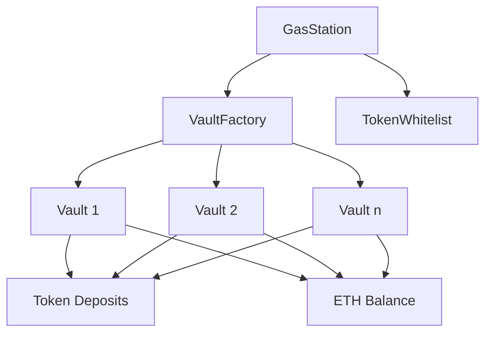

# Gas Station Smart Contracts

A decentralized gas fee payment system that allows users to pay for Ethereum gas fees using ERC20 tokens.

## Architecture

The system consists of several smart contracts working together to provide secure and efficient token-to-ETH conversion for gas payments:



### Core Components

#### GasStation

- Main entry point for users
- Handles token deposits and ETH distribution
- Manages payment tokens and price feeds
- Features:
  - Multi-token support with Chainlink price feeds
  - Permit-based token approvals
  - Rate limiting per block
  - Emergency pause mechanism

#### VaultFactory

- Creates and manages vault instances
- Maintains registry of all vaults
- Handles vault ownership and access control
- Features:
  - Upgradeable vault implementation
  - Owner-based vault creation
  - Efficient vault querying

#### Vault

- Stores and manages token/ETH balances
- Handles token deposits and ETH withdrawals
- Features:
  - Token whitelist integration
  - Emergency recovery mechanisms
  - Balance tracking per user/token

#### TokenWhitelist

- Manages allowed tokens
- Security layer for token operations
- Centralized token validation
- Features:
  - Default shared whitelist for all vaults
  - Flexible whitelist configuration options
  - Batch whitelist updates

## Key Features

### Vault Management

- Dynamic vault creation based on usage
- Automatic vault selection based on ETH balance
- Maximum vault limit for gas efficiency
- Balance distribution across vaults

### Security

- Reentrancy protection
- Pausable contracts
- Emergency withdrawal mechanisms
- Owner-only administrative functions
- Token whitelist validation

### Gas Optimization

- Efficient vault querying
- Minimal array usage
- Optimized balance checks
- Rate limiting per block

## Contract Interactions

1. User initiates token deposit with `exchangeWithPermit`
2. GasStation finds suitable vault using `findBestVault`
3. Tokens are transferred to the vault
4. ETH is sent to the user's destination address

## Whitelist Configuration

The system provides flexible whitelist management options:

### Default Behavior

By default, all vaults share a single TokenWhitelist contract. When a token is added to this whitelist, it becomes available to all vaults simultaneously:

```solidity
// Add a token to the shared whitelist
tokenWhitelist.addToken(tokenAddress);
```

### Customization Options

The system supports more advanced whitelist configurations:

1. **Update Global Whitelist**: The VaultFactory can point to a new whitelist contract for all new vaults:
   ```solidity
   // Update the whitelist for all new vaults
   vaultFactory.updateWhitelist(newWhitelistAddress);
   ```

2. **Individual Vault Whitelist**: Each vault can have its whitelist updated separately:
   ```solidity
   // Update whitelist for a specific vault
   vault.setTokenWhitelist(customWhitelistAddress);
   ```

3. **Batch Update**: Multiple vaults can be updated to use a different whitelist:
   ```solidity
   // Update multiple vaults to use a new whitelist
   vaultFactory.batchUpdateTokenWhitelist(vaultAddresses, newWhitelistAddress);
   ```

This flexibility allows for creating different token acceptance policies for different groups of vaults, though the default behavior is a shared whitelist for simplicity and consistency.

## Development

### Prerequisites

- Node.js >= 16
- Hardhat
- OpenZeppelin Contracts

### Setup

```bash
npm install
npx hardhat compile
```

### Testing

```bash
npx hardhat test
```

### Deployment

```bash
npx hardhat deploy --network <network>
```

## Security Considerations

### Rate Limiting

- Maximum deposits per block: 10
- Configurable deposit limits
- Price feed staleness checks

### Emergency Procedures

1. Owner can pause contracts
2. Withdrawals remain available during pause
3. Emergency token/ETH recovery
4. Balance protection during recovery

## Interface Integration

### Key Functions

```solidity
// Deposit tokens, receive ETH
function exchangeWithPermit(
    address token,
    uint256 amount,
    address destination,
    uint256 deadline,
    uint8 v,
    bytes32 r,
    bytes32 s
) external;

// Calculate ETH amount for token deposit
function calculateEthAmount(
    address token,
    uint256 amount
) external view returns (uint256);
```

## Error Handling

The system uses custom errors for clear error reporting:

- `InsufficientBalance`
- `VaultNotFound`
- `TokenNotSupported`
- `VaultBalanceDistributionNeeded`

## Upgradeability

All core contracts are upgradeable using the UUPS pattern:

- GasStation
- Vault
- VaultFactory
- TokenWhitelist

## License

MIT
