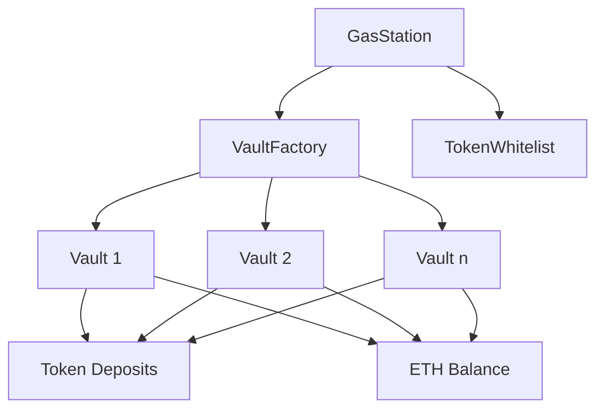

# Gas Station Smart Contracts

A decentralized gas fee payment system that allows users to pay for Ethereum gas fees using ERC20 tokens.

## Table of Contents
- [Gas Station Smart Contracts](#gas-station-smart-contracts)
  - [Table of Contents](#table-of-contents)
  - [Overview](#overview)
  - [Architecture](#architecture)
    - [Core Components](#core-components)
      - [GasStation](#gasstation)
      - [VaultFactory](#vaultfactory)
      - [Vault](#vault)
      - [TokenWhitelist](#tokenwhitelist)
  - [Key Features](#key-features)
    - [Vault Management](#vault-management)
    - [Security](#security)
    - [Gas Optimization](#gas-optimization)
  - [Contract Interactions](#contract-interactions)
  - [Whitelist Configuration](#whitelist-configuration)
    - [Default Behavior](#default-behavior)
    - [Customization Options](#customization-options)
  - [Development](#development)
    - [Prerequisites](#prerequisites)
    - [Quick Start](#quick-start)
    - [Setup](#setup)
    - [Testing](#testing)
    - [Deployment](#deployment)
      - [Deployment Flow](#deployment-flow)
      - [Multi-Network Deployment](#multi-network-deployment)
      - [Upgrading Contracts](#upgrading-contracts)
  - [Usage Examples](#usage-examples)
    - [Integrating with Your dApp](#integrating-with-your-dapp)
    - [Calculating ETH Amount](#calculating-eth-amount)
  - [Security Considerations](#security-considerations)
    - [Rate Limiting](#rate-limiting)
    - [Emergency Procedures](#emergency-procedures)
  - [Interface Integration](#interface-integration)
    - [Key Functions](#key-functions)
  - [Error Handling](#error-handling)
  - [Upgradeability](#upgradeability)
  - [Contributing](#contributing)
  - [License](#license)

## Overview

Gas Station is a protocol that enables users to pay for Ethereum transaction fees using ERC20 tokens instead of ETH. This solves the common UX problem where users need to hold ETH solely for gas payments, even when primarily using tokens.

**Key Benefits:**
- Pay gas fees with any supported ERC20 token
- No need to hold ETH for transactions
- Seamless integration with existing dApps
- Secure token-to-ETH conversion with price oracles
- Permit-based approvals for gasless token transfers

## Architecture

The system consists of several smart contracts working together to provide secure and efficient token-to-ETH conversion for gas payments:



**Flow Explanation:**
1. The GasStation contract serves as the main entry point
2. It interacts with the VaultFactory to manage multiple Vault instances
3. Each Vault stores token deposits and ETH balances
4. The TokenWhitelist provides security by validating supported tokens
5. When a user deposits tokens, they receive ETH for gas at the current exchange rate

### Core Components

#### GasStation

- Main entry point for users
- Handles token deposits and ETH distribution
- Manages payment tokens and price feeds
- Features:
  - Multi-token support with Chainlink price feeds
  - Permit-based token approvals
  - Rate limiting per block
  - Emergency pause mechanism

#### VaultFactory

- Creates and manages vault instances
- Maintains registry of all vaults
- Handles vault ownership and access control
- Features:
  - Upgradeable vault implementation
  - Owner-based vault creation
  - Efficient vault querying

#### Vault

- Stores and manages token/ETH balances
- Handles token deposits and ETH withdrawals
- Features:
  - Token whitelist integration
  - Emergency recovery mechanisms
  - Balance tracking per user/token

#### TokenWhitelist

- Manages allowed tokens
- Security layer for token operations
- Centralized token validation
- Features:
  - Default shared whitelist for all vaults
  - Flexible whitelist configuration options
  - Batch whitelist updates

## Key Features

### Vault Management

- Dynamic vault creation based on usage
- Automatic vault selection based on ETH balance
- Maximum vault limit for gas efficiency
- Balance distribution across vaults

### Security

- Reentrancy protection
- Pausable contracts
- Emergency withdrawal mechanisms
- Owner-only administrative functions
- Token whitelist validation

### Gas Optimization

- Efficient vault querying
- Minimal array usage
- Optimized balance checks
- Rate limiting per block

## Contract Interactions

1. User initiates token deposit with `exchangeWithPermit`
2. GasStation finds suitable vault using `findBestVault`
3. Tokens are transferred to the vault
4. ETH is sent to the user's destination address

## Whitelist Configuration

The system provides flexible whitelist management options:

### Default Behavior

By default, all vaults share a single TokenWhitelist contract. When a token is added to this whitelist, it becomes available to all vaults simultaneously:

```solidity
// Add a token to the shared whitelist
tokenWhitelist.addToken(tokenAddress);
```

### Customization Options

The system supports more advanced whitelist configurations:

1. **Update Global Whitelist**: The VaultFactory can point to a new whitelist contract for all new vaults:

   ```solidity
   // Update the whitelist for all new vaults
   vaultFactory.updateWhitelist(newWhitelistAddress);
   ```

2. **Individual Vault Whitelist**: Each vault can have its whitelist updated separately:

   ```solidity
   // Update whitelist for a specific vault
   vault.setTokenWhitelist(customWhitelistAddress);
   ```

3. **Batch Update**: Multiple vaults can be updated to use a different whitelist:

   ```solidity
   // Update multiple vaults to use a new whitelist
   vaultFactory.batchUpdateTokenWhitelist(vaultAddresses, newWhitelistAddress);
   ```

This flexibility allows for creating different token acceptance policies for different groups of vaults, though the default behavior is a shared whitelist for simplicity and consistency.

## Development

### Prerequisites

- Node.js >= 16
- Hardhat
- OpenZeppelin Contracts
- Ethereum wallet (MetaMask, etc.)
- Access to Ethereum RPC endpoint

### Quick Start

```bash
# Clone the repository
git clone https://github.com/yourusername/gas-station-bot.git
cd gas-station-bot/apps/eth-contracts

# Install dependencies
npm install

# Compile contracts
npx hardhat compile

# Run tests
npx hardhat test

# Deploy to local network
npx hardhat node
npx hardhat run scripts/deploy.js --network localhost
```

### Setup

```bash
npm install
npx hardhat compile
```

### Testing

```bash
npx hardhat test
```

### Deployment

```bash
npx hardhat deploy --network <network>
```

#### Deployment Flow

The deployment process follows a specific sequence to ensure all contracts are properly initialized and connected:

1. **Environment Setup**

   ```bash
   # Create .env file with required variables
   cp .env.example .env

   # Edit .env with your configuration
   # Required variables:
   # - PRIVATE_KEY: Deployer wallet private key
   # - RPC_URL_<NETWORK>: RPC endpoint for target network
   # - ETHERSCAN_API_KEY: For contract verification
   ```

2. **Deployment Sequence**

   ```bash
   # Deploy all contracts in the correct order
   npx hardhat run scripts/deploy.js --network <network>
   ```

   The deployment script handles the following steps:
   - Deploy TokenWhitelist contract
   - Deploy VaultFactory contract with TokenWhitelist address
   - Deploy initial Vault implementation
   - Set Vault implementation in VaultFactory
   - Deploy GasStation contract with VaultFactory address
   - Transfer ownership to final admin address

3. **Contract Verification**

   ```bash
   # Verify contracts on Etherscan/block explorer
   npx hardhat verify --network <network> <CONTRACT_ADDRESS> <CONSTRUCTOR_ARGS>

   # Example: Verify GasStation contract
   npx hardhat verify --network mainnet 0x1234...5678 "0xabcd...ef01"
   ```

4. **Post-Deployment Configuration**

   ```bash
   # Add supported tokens to whitelist
   npx hardhat run scripts/add-tokens.js --network <network>

   # Configure price feeds
   npx hardhat run scripts/set-price-feeds.js --network <network>

   # Create initial vaults
   npx hardhat run scripts/create-vaults.js --network <network>
   ```

5. **Deployment Verification**

   ```bash
   # Verify deployment is working correctly
   npx hardhat run scripts/verify-deployment.js --network <network>
   ```

   This script performs the following checks:
   - All contracts are deployed and initialized
   - Ownership is correctly set
   - Tokens can be exchanged for ETH
   - Vaults are functioning properly

#### Multi-Network Deployment

For deploying to multiple networks, the repository includes network-specific configuration:

```javascript
// hardhat.config.js
module.exports = {
  networks: {
    mainnet: {
      url: process.env.RPC_URL_MAINNET,
      accounts: [process.env.PRIVATE_KEY]
    },
    goerli: {
      url: process.env.RPC_URL_GOERLI,
      accounts: [process.env.PRIVATE_KEY]
    },
    arbitrum: {
      url: process.env.RPC_URL_ARBITRUM,
      accounts: [process.env.PRIVATE_KEY]
    }
    // Add other networks as needed
  }
};
```

#### Upgrading Contracts

To upgrade any of the contracts:

```bash
# Deploy new implementation
npx hardhat run scripts/upgrade-<contract>.js --network <network>
```

The upgrade scripts handle:

- Deploying new implementation contract
- Setting the implementation in the proxy
- Verifying the new implementation on Etherscan

## Usage Examples

### Integrating with Your dApp

```javascript
// Initialize the Gas Station contract
const gasStation = new ethers.Contract(
  GAS_STATION_ADDRESS,
  GAS_STATION_ABI,
  provider
);

// Get token approval using permit
const { v, r, s } = await getPermitSignature(
  token,
  amount,
  deadline,
  signer
);

// Exchange tokens for ETH
await gasStation.exchangeWithPermit(
  tokenAddress,
  amount,
  destinationAddress,
  deadline,
  v,
  r,
  s
);
```

### Calculating ETH Amount

```javascript
// Calculate how much ETH will be received for a token amount
const ethAmount = await gasStation.calculateEthAmount(
  tokenAddress,
  tokenAmount
);
console.log(`You will receive ${ethers.utils.formatEther(ethAmount)} ETH`);
```

## Security Considerations

### Rate Limiting

- Maximum deposits per block: 10
- Configurable deposit limits
- Price feed staleness checks

### Emergency Procedures

1. Owner can pause contracts
2. Withdrawals remain available during pause
3. Emergency token/ETH recovery
4. Balance protection during recovery

## Interface Integration

### Key Functions

```solidity
// Deposit tokens, receive ETH
function exchangeWithPermit(
    address token,
    uint256 amount,
    address destination,
    uint256 deadline,
    uint8 v,
    bytes32 r,
    bytes32 s
) external;

// Calculate ETH amount for token deposit
function calculateEthAmount(
    address token,
    uint256 amount
) external view returns (uint256);
```

## Error Handling

The system uses custom errors for clear error reporting:

- `InsufficientBalance` - Not enough tokens or ETH in the vault
- `VaultNotFound` - No suitable vault available for the operation
- `TokenNotSupported` - The token is not on the whitelist
- `VaultBalanceDistributionNeeded` - ETH balance needs redistribution across vaults

## Upgradeability

All core contracts are upgradeable using the UUPS pattern:

- GasStation
- Vault
- VaultFactory
- TokenWhitelist

## Contributing

Contributions are welcome! Please follow these steps:

1. Fork the repository
2. Create a feature branch (`git checkout -b feature/amazing-feature`)
3. Commit your changes (`git commit -m 'Add some amazing feature'`)
4. Push to the branch (`git push origin feature/amazing-feature`)
5. Open a Pull Request

Please ensure your code follows the project's coding standards and includes appropriate tests.

## License

MIT
