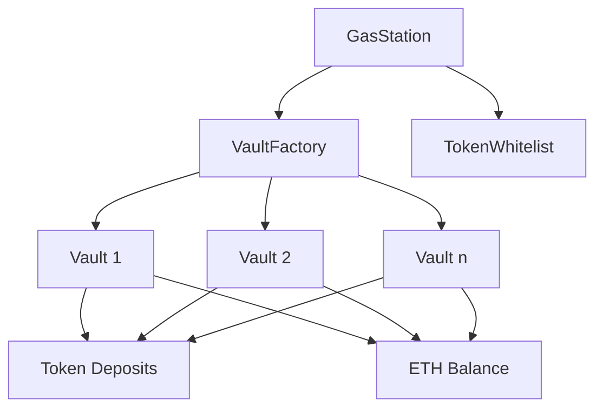

# Gas Station Smart Contracts

A decentralized gas fee payment system that allows users to pay for Ethereum gas fees using ERC20 tokens.

## Table of Contents

- [Gas Station Smart Contracts](#gas-station-smart-contracts)
  - [Table of Contents](#table-of-contents)
  - [Overview](#overview)
  - [Architecture](#architecture)
    - [Core Components](#core-components)
      - [GasStation](#gasstation)
      - [VaultFactory](#vaultfactory)
      - [Vault](#vault)
      - [TokenWhitelist](#tokenwhitelist)
  - [Key Features](#key-features)
    - [Vault Management](#vault-management)
    - [Security](#security)
    - [Gas Optimization](#gas-optimization)
  - [Contract Interactions](#contract-interactions)
  - [Whitelist Configuration](#whitelist-configuration)
    - [Default Behavior](#default-behavior)
    - [Customization Options](#customization-options)
  - [Development](#development)
    - [Prerequisites](#prerequisites)
    - [Quick Start](#quick-start)
    - [Setup](#setup)
    - [Testing](#testing)
    - [Deployment](#deployment)
      - [Deployment Flow](#deployment-flow)
      - [Multi-Network Deployment](#multi-network-deployment)
      - [Upgrading Contracts](#upgrading-contracts)
  - [Usage Examples](#usage-examples)
    - [Integrating with Your dApp](#integrating-with-your-dapp)
    - [Calculating ETH Amount](#calculating-eth-amount)
  - [Security Considerations](#security-considerations)
    - [Rate Limiting](#rate-limiting)
    - [Role Separation](#role-separation)
    - [Emergency Procedures](#emergency-procedures)
  - [Interface Integration](#interface-integration)
    - [User-Facing Functions](#user-facing-functions)
      - [How Exchange Functions Work](#how-exchange-functions-work)
      - [View Functions](#view-functions)
    - [Admin Functions](#admin-functions)
      - [Token Management Functions](#token-management-functions)
      - [Vault Management Functions](#vault-management-functions)
      - [Emergency Functions](#emergency-functions)
  - [Fee Module](#fee-module)
    - [Fee Structure](#fee-structure)
    - [Fee Configuration](#fee-configuration)
    - [User-Facing Fee Functions](#user-facing-fee-functions)
      - [Calculate Fee](#calculate-fee)
      - [Calculate Amount After Fee](#calculate-amount-after-fee)
      - [Get Applicable Fee Tier](#get-applicable-fee-tier)
      - [Get User Volume](#get-user-volume)
      - [Get Total Fees Collected](#get-total-fees-collected)
      - [Get Fee Tiers](#get-fee-tiers)
    - [Admin Fee Functions](#admin-fee-functions)
      - [Add Fee Tier](#add-fee-tier)
      - [Update Fee Tier](#update-fee-tier)
      - [Remove Fee Tier](#remove-fee-tier)
      - [Set Maximum Fee](#set-maximum-fee)
      - [Set Fee Collector](#set-fee-collector)
      - [Toggle Fee Collection](#toggle-fee-collection)
      - [Withdraw Fees](#withdraw-fees)
    - [Fee Events](#fee-events)
    - [Integration Example: Displaying Fee Information](#integration-example-displaying-fee-information)
    - [Fee Module Security Considerations](#fee-module-security-considerations)
  - [Code Examples](#code-examples)
    - [User Interaction Examples](#user-interaction-examples)
      - [Basic Token Exchange](#basic-token-exchange)
      - [Using Permit for Gasless Approvals](#using-permit-for-gasless-approvals)
      - [Checking Supported Tokens](#checking-supported-tokens)
    - [Admin Examples](#admin-examples)
      - [Adding a New Payment Token](#adding-a-new-payment-token)
      - [Setting Deposit Limits](#setting-deposit-limits)
      - [Managing Vaults](#managing-vaults)
      - [Emergency Operations](#emergency-operations)
  - [Admin Role Management](#admin-role-management)
    - [Admin vs Owner Responsibilities](#admin-vs-owner-responsibilities)
    - [Admin Role Features](#admin-role-features)
      - [Setting a New Admin](#setting-a-new-admin)
      - [Processing Withdrawals as Admin](#processing-withdrawals-as-admin)
      - [ETH Withdrawal Example](#eth-withdrawal-example)
      - [Checking Admin Status](#checking-admin-status)
  - [Error Handling](#error-handling)
  - [Upgradeability](#upgradeability)
  - [Contributing](#contributing)
  - [License](#license)

## Overview

Gas Station is a protocol that enables users to pay for Ethereum transaction fees using ERC20 tokens instead of ETH. This solves the common UX problem where users need to hold ETH solely for gas payments, even when primarily using tokens.

**Key Benefits:**

- Pay gas fees with any supported ERC20 token
- No need to hold ETH for transactions
- Seamless integration with existing dApps
- Secure token-to-ETH conversion with price oracles
- Permit-based approvals for gasless token transfers

## Architecture

The system consists of several smart contracts working together to provide secure and efficient token-to-ETH conversion for gas payments:


```mermaid
graph TD
    A[GasStation] --> B[VaultFactory]
    B --> C[Vault 1]
    B --> D[Vault 2]
    B --> E[Vault n]
    A --> F[TokenWhitelist]
    C & D & E --> G[Token Deposits]
    C & D & E --> H[ETH Balance]
```

**Flow Explanation:**

1. The GasStation contract serves as the main entry point
2. It interacts with the VaultFactory to manage multiple Vault instances
3. Each Vault stores token deposits and ETH balances
4. The TokenWhitelist provides security by validating supported tokens
5. When a user deposits tokens, they receive ETH for gas at the current exchange rate

### Core Components

#### GasStation

- Main entry point for users
- Handles token deposits and ETH distribution
- Manages payment tokens and price feeds
- Features:
  - Multi-token support with Chainlink price feeds
  - Permit-based token approvals
  - Rate limiting per block
  - Emergency pause mechanism

#### VaultFactory

- Creates and manages vault instances
- Maintains registry of all vaults
- Handles vault ownership and access control
- Features:
  - Upgradeable vault implementation
  - Owner-based vault creation
  - Efficient vault querying

#### Vault

- Stores and manages token/ETH balances
- Handles token deposits and ETH withdrawals
- Features:
  - Token whitelist integration
  - Admin role for withdrawal management
  - Emergency recovery mechanisms
  - Balance tracking per user/token

#### TokenWhitelist

- Manages allowed tokens
- Security layer for token operations
- Centralized token validation
- Features:
  - Default shared whitelist for all vaults
  - Flexible whitelist configuration options
  - Batch whitelist updates

## Key Features

### Vault Management

- Dynamic vault creation based on usage
- Automatic vault selection based on ETH balance
- Maximum vault limit for gas efficiency
- Balance distribution across vaults

### Security

- Reentrancy protection
- Pausable contracts
- Admin role separation for withdrawals
- Emergency withdrawal mechanisms
- Owner-only administrative functions
- Token whitelist validation

### Gas Optimization

- Efficient vault querying
- Minimal array usage
- Optimized balance checks
- Rate limiting per block

## Contract Interactions

1. User initiates token deposit with `exchangeWithPermit`
2. GasStation finds suitable vault using `findBestVault`
3. Tokens are transferred to the vault
4. ETH is sent to the user's destination address

## Whitelist Configuration

The system provides flexible whitelist management options:

### Default Behavior

By default, all vaults share a single TokenWhitelist contract. When a token is added to this whitelist, it becomes available to all vaults simultaneously:

```solidity
// Add a token to the shared whitelist
tokenWhitelist.addToken(tokenAddress);
```

### Customization Options

The system supports more advanced whitelist configurations:

1. **Update Global Whitelist**: The VaultFactory can point to a new whitelist contract for all new vaults:

   ```solidity
   // Update the whitelist for all new vaults
   vaultFactory.updateWhitelist(newWhitelistAddress);
   ```

2. **Individual Vault Whitelist**: Each vault can have its whitelist updated separately:

   ```solidity
   // Update whitelist for a specific vault
   vault.setTokenWhitelist(customWhitelistAddress);
   ```

3. **Batch Update**: Multiple vaults can be updated to use a different whitelist:

   ```solidity
   // Update multiple vaults to use a new whitelist
   vaultFactory.batchUpdateTokenWhitelist(vaultAddresses, newWhitelistAddress);
   ```

This flexibility allows for creating different token acceptance policies for different groups of vaults, though the default behavior is a shared whitelist for simplicity and consistency.

## Development

### Prerequisites

- Node.js >= 16
- Hardhat
- OpenZeppelin Contracts
- Ethereum wallet (MetaMask, etc.)
- Access to Ethereum RPC endpoint

### Quick Start

```bash
# Clone the repository
git clone https://github.com/yourusername/gas-station-bot.git
cd gas-station-bot/apps/eth-contracts

# Install dependencies
npm install

# Compile contracts
npx hardhat compile

# Run tests
npx hardhat test

# Deploy to local network
npx hardhat node
npx hardhat run scripts/deploy.js --network localhost
```

### Setup

```bash
npm install
npx hardhat compile
```

### Testing

```bash
npx hardhat test
```

### Deployment

```bash
npx hardhat deploy --network <network>
```

#### Deployment Flow

The deployment process follows a specific sequence to ensure all contracts are properly initialized and connected:

1. **Environment Setup**

   ```bash
   # Create .env file with required variables
   cp .env.example .env

   # Edit .env with your configuration
   # Required variables:
   # - PRIVATE_KEY: Deployer wallet private key
   # - RPC_URL_<NETWORK>: RPC endpoint for target network
   # - ETHERSCAN_API_KEY: For contract verification
   ```

2. **Deployment Sequence**

   ```bash
   # Deploy all contracts in the correct order
   npx hardhat run scripts/deploy.js --network <network>
   ```

   The deployment script handles the following steps:
   - Deploy TokenWhitelist contract
   - Deploy VaultFactory contract with TokenWhitelist address
   - Deploy initial Vault implementation
   - Set Vault implementation in VaultFactory
   - Deploy GasStation contract with VaultFactory address
   - Transfer ownership to final admin address

3. **Contract Verification**

   ```bash
   # Verify contracts on Etherscan/block explorer
   npx hardhat verify --network <network> <CONTRACT_ADDRESS> <CONSTRUCTOR_ARGS>

   # Example: Verify GasStation contract
   npx hardhat verify --network mainnet 0x1234...5678 "0xabcd...ef01"
   ```

4. **Post-Deployment Configuration**

   ```bash
   # Add supported tokens to whitelist
   npx hardhat run scripts/add-tokens.js --network <network>

   # Configure price feeds
   npx hardhat run scripts/set-price-feeds.js --network <network>

   # Create initial vaults
   npx hardhat run scripts/create-vaults.js --network <network>
   ```

5. **Deployment Verification**

   ```bash
   # Verify deployment is working correctly
   npx hardhat run scripts/verify-deployment.js --network <network>
   ```

   This script performs the following checks:
   - All contracts are deployed and initialized
   - Ownership is correctly set
   - Tokens can be exchanged for ETH
   - Vaults are functioning properly

#### Multi-Network Deployment

For deploying to multiple networks, the repository includes network-specific configuration:

```javascript
// hardhat.config.js
module.exports = {
  networks: {
    mainnet: {
      url: process.env.RPC_URL_MAINNET,
      accounts: [process.env.PRIVATE_KEY]
    },
    goerli: {
      url: process.env.RPC_URL_GOERLI,
      accounts: [process.env.PRIVATE_KEY]
    },
    arbitrum: {
      url: process.env.RPC_URL_ARBITRUM,
      accounts: [process.env.PRIVATE_KEY]
    }
    // Add other networks as needed
  }
};
```

#### Upgrading Contracts

To upgrade any of the contracts:

```bash
# Deploy new implementation
npx hardhat run scripts/upgrade-<contract>.js --network <network>
```

The upgrade scripts handle:

- Deploying new implementation contract
- Setting the implementation in the proxy
- Verifying the new implementation on Etherscan

## Usage Examples

### Integrating with Your dApp

```javascript
// Initialize the Gas Station contract
const gasStation = new ethers.Contract(
  GAS_STATION_ADDRESS,
  GAS_STATION_ABI,
  provider
);

// Get token approval using permit
const { v, r, s } = await getPermitSignature(
  token,
  amount,
  deadline,
  signer
);

// Exchange tokens for ETH
await gasStation.exchangeWithPermit(
  tokenAddress,
  amount,
  destinationAddress,
  deadline,
  v,
  r,
  s
);
```

### Calculating ETH Amount

```javascript
// Calculate how much ETH will be received for a token amount
const ethAmount = await gasStation.calculateEthAmount(
  tokenAddress,
  tokenAmount
);
console.log(`You will receive ${ethers.utils.formatEther(ethAmount)} ETH`);
```

## Security Considerations

### Rate Limiting

- Maximum deposits per block: 10
- Configurable deposit limits
- Price feed staleness checks

### Role Separation

- Owner role for critical contract management
- Admin role for withdrawal operations
- Gas Station role for ETH distribution
- Clear separation of responsibilities enhances security

### Emergency Procedures

1. Owner can pause contracts
2. Withdrawals remain available during pause
3. Emergency token/ETH recovery
4. Balance protection during recovery

## Interface Integration

The GasStation contract exposes several external functions for interacting with the protocol. These functions are divided into user-facing functions and admin functions.

### User-Facing Functions

```solidity
// Exchange tokens for ETH using regular approve/transferFrom pattern
function exchange(ExchangeParams calldata params) external nonReentrant whenNotPaused;

// Exchange tokens for ETH using permit for gasless approvals
function exchangeWithPermit(PermitParams calldata params) external nonReentrant whenNotPaused;

// Calculate ETH amount for a given token amount
function calculateEthAmount(address token, uint256 amount) external view returns (uint256);

// Get all supported payment tokens
function getSupportedTokens() external view returns (address[] memory);

// Find the best vault with sufficient ETH balance
function findBestVault(uint256 requiredEth) external view returns (address vault, uint256 balance);

// Get the scaling factor for a token (debug function)
function getScalingFactor(address token) external view returns (uint64);

// Calculate the fee for a given token amount
function calculateFee(address token, uint256 amount) external view returns (uint256);

// Calculate the amount after fee deduction
function calculateAmountAfterFee(address token, uint256 amount) external view returns (uint256);
```

#### How Exchange Functions Work

1. **exchange**:
   - Takes a token address, amount, and destination address
   - Validates the token is supported and amount is within limits
   - Checks rate limiting to prevent abuse
   - Calculates the equivalent ETH amount using price feeds
   - Finds a vault with sufficient ETH balance
   - Transfers tokens from user to GasStation, then to the vault
   - Instructs the vault to send ETH to the destination address
   - Emits a `DepositProcessed` event with transaction details

2. **exchangeWithPermit**:
   - Similar to `exchange` but uses ERC20 permit functionality
   - Allows users to approve token spending without a separate transaction
   - Validates the permit signature and deadline
   - Uses the default token if none is specified
   - Processes the exchange after the permit is validated
   - Particularly useful for users without ETH for gas fees

#### View Functions

1. **calculateEthAmount**:
   - Calculates how much ETH a user will receive for a given token amount
   - Uses Chainlink price feeds to get current token/ETH exchange rates
   - Applies appropriate scaling based on token decimals
   - Verifies price feed data is recent (within 30 minutes)
   - Returns the equivalent ETH amount with 18 decimals

2. **getSupportedTokens**:
   - Returns an array of all supported token addresses
   - Useful for UIs to display available payment options

3. **findBestVault**:
   - Finds a vault with sufficient ETH balance for a transaction
   - Checks vaults in order of recency and balance
   - Returns the vault address and its current ETH balance
   - Used internally but exposed for debugging and informational purposes

### Admin Functions

```solidity
// Set a new default token
function setDefaultToken(address _newDefaultToken) external onlyOwner;

// Add or update a payment token
function addPaymentToken(address token, address priceFeed) external onlyOwner;

// Remove a payment token
function removePaymentToken(address token) external onlyOwner;

// Set the vault factory address
function setVaultFactory(address _vaultFactory) external nonReentrant onlyOwner;

// Set the gas station address in a Vault contract
function setVaultGasStation(address vault, address gasStation) external nonReentrant onlyOwner;

// Emergency withdraw any ERC20 token (only when paused)
function emergencyWithdrawToken(WithdrawalParams calldata params) external nonReentrant onlyOwner;

// Enable emergency mode (pauses contract)
function enableEmergencyMode() external onlyOwner;

// Disable emergency mode (unpauses contract)
function disableEmergencyMode() external onlyOwner;
```

#### Token Management Functions

1. **setDefaultToken**:
   - Sets the default token used when no token is specified
   - The token must already be in the supported tokens list
   - Emits a `DefaultTokenUpdated` event

2. **addPaymentToken**:
   - Adds a new token or updates an existing one
   - Requires a valid Chainlink price feed address
   - Calculates the appropriate scaling factor based on token decimals
   - Emits a `PaymentTokenUpdated` event with token details

3. **removePaymentToken**:
   - Removes a token from the supported tokens list
   - Emits a `PaymentTokenRemoved` event

4. **setDepositLimits**:
   - Updates the minimum and maximum deposit amounts for tokens
   - Ensures the minimum amount is less than the maximum amount
   - Applies to all supported tokens
   - Emits a `DepositLimitsUpdated` event with new limits

#### Vault Management Functions

1. **setVaultFactory**:
   - Updates the VaultFactory contract address
   - Used when upgrading or changing the vault factory
   - Emits a `VaultFactorySet` event

2. **setVaultGasStation**:
   - Sets the GasStation address in a specific Vault contract
   - Ensures the vault recognizes the GasStation for operations

3. **setAdmin**:
   - Sets the admin address responsible for withdrawals
   - Separates withdrawal permissions from ownership
   - Emits an `AdminSet` event with previous and new admin addresses
   - Only callable by the owner

#### Emergency Functions

1. **emergencyWithdrawToken**:
   - Allows the owner to withdraw any ERC20 token from the contract
   - Only works when the contract is paused (emergency mode)
   - Prevents loss of funds in emergency situations
   - Emits an `EmergencyWithdrawal` event

2. **enableEmergencyMode**:
   - Pauses the contract, preventing new exchanges
   - Used in case of security issues or unexpected behavior
   - Emits an `EmergencyModeEnabled` event

3. **disableEmergencyMode**:
   - Unpauses the contract, resuming normal operation
   - Emits an `EmergencyModeDisabled` event

## Fee Module

The Gas Station includes a comprehensive fee module that allows for flexible fee management based on transaction amounts. This module enables the protocol to collect fees on token exchanges, which can be used for protocol sustainability, treasury growth, or other purposes.

### Fee Structure

The fee system is built around the concept of tiered fees, where different fee percentages are applied based on the transaction amount:

```solidity
// Fee tier structure
struct FeeTier {
    uint256 minAmount; // Minimum amount for this tier
    uint256 feeBps; // Fee in basis points (1% = 100 bps)
    bool isActive; // Whether this tier is active
}
```

By default, the system initializes with three tiers for the default token (e.g., USDC):

1. Tier 1: 0-100 USDC with a 0.5% fee (50 basis points)
2. Tier 2: 100-500 USDC with a 0.4% fee (40 basis points)
3. Tier 3: 500+ USDC with a 0.3% fee (30 basis points)

This tiered approach incentivizes larger transactions by offering lower fee percentages.

### Fee Configuration

The fee module includes several configuration options:

```solidity
// Fee configuration
struct FeeConfig {
    uint256 maxFeeBps; // Maximum allowed fee in basis points
    address feeCollector; // Address to collect fees
    bool feeEnabled; // Whether fee collection is enabled
}
```

- `maxFeeBps`: The maximum fee percentage that can be set for any tier (default: 50 basis points or 0.5%)
- `feeCollector`: The address that receives collected fees (default: contract owner)
- `feeEnabled`: A toggle to enable/disable fee collection globally

### User-Facing Fee Functions

Users can interact with the following fee-related functions:

#### Calculate Fee

```solidity
function calculateFee(address token, uint256 amount) public view returns (uint256)
```

This function calculates the fee amount for a given token and amount based on the applicable fee tier. It returns the fee amount in the same token.

**Parameters:**

- `token`: The token address
- `amount`: The amount to calculate the fee for

**Returns:**

- `uint256`: The fee amount in the same token

**Example:**

```javascript
// Calculate fee for 1000 USDC
const usdcAddress = "0xA0b86991c6218b36c1d19D4a2e9Eb0cE3606eB48";
const amount = ethers.parseUnits("1000", 6); // USDC has 6 decimals
const fee = await gasStation.calculateFee(usdcAddress, amount);
console.log(`Fee: ${ethers.formatUnits(fee, 6)} USDC`); // Should be 3 USDC (0.3%)
```

#### Calculate Amount After Fee

```solidity
function calculateAmountAfterFee(address token, uint256 amount) external view returns (uint256)
```

This function calculates the amount a user will receive after fee deduction. It's useful for displaying the net amount to users before they execute a transaction.

**Parameters:**

- `token`: The token address
- `amount`: The original amount

**Returns:**

- `uint256`: The amount after fee deduction

**Example:**

```javascript
// Calculate net amount after fee for 1000 USDC
const usdcAddress = "0xA0b86991c6218b36c1d19D4a2e9Eb0cE3606eB48";
const amount = ethers.parseUnits("1000", 6);
const amountAfterFee = await gasStation.calculateAmountAfterFee(usdcAddress, amount);
console.log(`Amount after fee: ${ethers.formatUnits(amountAfterFee, 6)} USDC`); // Should be 997 USDC
```

#### Get Applicable Fee Tier

```solidity
function getApplicableTier(address token, uint256 amount) public view returns (FeeTier memory)
```

This function returns the applicable fee tier for a given token amount.

**Parameters:**

- `token`: The token address
- `amount`: The amount to find the tier for

**Returns:**

- `FeeTier`: The applicable fee tier structure

**Example:**

```javascript
// Get the applicable fee tier for 1000 USDC
const usdcAddress = "0xA0b86991c6218b36c1d19D4a2e9Eb0cE3606eB48";
const amount = ethers.parseUnits("1000", 6);
const tier = await gasStation.getApplicableTier(usdcAddress, amount);
console.log(`Tier minimum amount: ${ethers.formatUnits(tier.minAmount, 6)} USDC`);
console.log(`Tier fee: ${tier.feeBps / 100}%`);
```

#### Get User Volume

```solidity
function getUserVolume(address user, address token) external view returns (uint256)
```

This function returns the total volume of a specific token that a user has exchanged through the Gas Station.

**Parameters:**

- `user`: The user address
- `token`: The token address

**Returns:**

- `uint256`: The total volume

**Example:**

```javascript
// Get user's total USDC volume
const userAddress = "0x...";
const usdcAddress = "0xA0b86991c6218b36c1d19D4a2e9Eb0cE3606eB48";
const volume = await gasStation.getUserVolume(userAddress, usdcAddress);
console.log(`Total volume: ${ethers.formatUnits(volume, 6)} USDC`);
```

#### Get Total Fees Collected

```solidity
function getTotalFeesCollected(address token) external view returns (uint256)
```

This function returns the total fees collected for a specific token.

**Parameters:**

- `token`: The token address

**Returns:**

- `uint256`: The total fees collected

**Example:**

```javascript
// Get total USDC fees collected
const usdcAddress = "0xA0b86991c6218b36c1d19D4a2e9Eb0cE3606eB48";
const fees = await gasStation.getTotalFeesCollected(usdcAddress);
console.log(`Total fees collected: ${ethers.formatUnits(fees, 6)} USDC`);
```

#### Get Fee Tiers

```solidity
function getFeeTiers(address token) external view returns (FeeTier[] memory)
```

This function returns all fee tiers for a specific token.

**Parameters:**

- `token`: The token address

**Returns:**

- `FeeTier[]`: Array of fee tiers

**Example:**

```javascript
// Get all fee tiers for USDC
const usdcAddress = "0xA0b86991c6218b36c1d19D4a2e9Eb0cE3606eB48";
const tiers = await gasStation.getFeeTiers(usdcAddress);
console.log(`Number of tiers: ${tiers.length}`);
tiers.forEach((tier, index) => {
  console.log(`Tier ${index + 1}:`);
  console.log(`  Min Amount: ${ethers.formatUnits(tier.minAmount, 6)} USDC`);
  console.log(`  Fee: ${tier.feeBps / 100}%`);
  console.log(`  Active: ${tier.isActive}`);
});
```

### Admin Fee Functions

The following functions are available to the contract owner for managing fees:

#### Add Fee Tier

```solidity
function addFeeTier(address token, uint256 minAmount, uint256 feeBps) external onlyOwner
```

This function adds a new fee tier for a specific token.

**Parameters:**

- `token`: The token address
- `minAmount`: The minimum amount for this tier
- `feeBps`: The fee in basis points (1% = 100 bps)

**Example:**

```javascript
// Add a new fee tier for USDC: 1000+ USDC with 0.2% fee
const usdcAddress = "0xA0b86991c6218b36c1d19D4a2e9Eb0cE3606eB48";
const minAmount = ethers.parseUnits("1000", 6);
const feeBps = 20; // 0.2%
await gasStation.addFeeTier(usdcAddress, minAmount, feeBps);
```

#### Update Fee Tier

```solidity
function updateFeeTier(address token, uint256 tierIndex, uint256 minAmount, uint256 feeBps) external onlyOwner
```

This function updates an existing fee tier.

**Parameters:**

- `token`: The token address
- `tierIndex`: The index of the tier to update
- `minAmount`: The new minimum amount for this tier
- `feeBps`: The new fee in basis points

**Example:**

```javascript
// Update the second tier for USDC: 100-500 USDC with 0.35% fee
const usdcAddress = "0xA0b86991c6218b36c1d19D4a2e9Eb0cE3606eB48";
const tierIndex = 1; // 0-based index, so 1 is the second tier
const minAmount = ethers.parseUnits("100", 6);
const feeBps = 35; // 0.35%
await gasStation.updateFeeTier(usdcAddress, tierIndex, minAmount, feeBps);
```

#### Remove Fee Tier

```solidity
function removeFeeTier(address token, uint256 tierIndex) external onlyOwner
```

This function removes a fee tier.

**Parameters:**

- `token`: The token address
- `tierIndex`: The index of the tier to remove

**Example:**

```javascript
// Remove the third tier for USDC
const usdcAddress = "0xA0b86991c6218b36c1d19D4a2e9Eb0cE3606eB48";
const tierIndex = 2; // 0-based index, so 2 is the third tier
await gasStation.removeFeeTier(usdcAddress, tierIndex);
```

#### Set Maximum Fee

```solidity
function setMaxFeeBps(uint256 maxFeeBps) external onlyOwner
```

This function sets the maximum allowed fee in basis points.

**Parameters:**

- `maxFeeBps`: The maximum fee in basis points

**Example:**

```javascript
// Set maximum fee to 1% (100 basis points)
const maxFeeBps = 100;
await gasStation.setMaxFeeBps(maxFeeBps);
```

#### Set Fee Collector

```solidity
function setFeeCollector(address feeCollector) external onlyOwner
```

This function sets the address that will receive collected fees.

**Parameters:**

- `feeCollector`: The new fee collector address

**Example:**

```javascript
// Set fee collector to treasury address
const treasuryAddress = "0x...";
await gasStation.setFeeCollector(treasuryAddress);
```

#### Toggle Fee Collection

```solidity
function toggleFeeCollection(bool enabled) external onlyOwner
```

This function enables or disables fee collection globally.

**Parameters:**

- `enabled`: Whether to enable or disable fee collection

**Example:**

```javascript
// Disable fee collection
await gasStation.toggleFeeCollection(false);

// Later, re-enable fee collection
await gasStation.toggleFeeCollection(true);
```

#### Withdraw Fees

```solidity
function withdrawFees(address token) external onlyOwner
```

This function withdraws collected fees for a specific token to the fee collector address.

**Parameters:**

- `token`: The token to withdraw fees for

**Example:**

```javascript
// Withdraw collected USDC fees
const usdcAddress = "0xA0b86991c6218b36c1d19D4a2e9Eb0cE3606eB48";
await gasStation.withdrawFees(usdcAddress);
```

### Fee Events

The fee module emits the following events:

```solidity
// Fee related events
event FeeTierAdded(address indexed token, uint256 minAmount, uint256 feeBps);
event FeeTierUpdated(address indexed token, uint256 tierIndex, uint256 minAmount, uint256 feeBps);
event FeeTierRemoved(address indexed token, uint256 tierIndex);
event MaxFeeUpdated(uint256 maxFeeBps);
event FeeCollectorUpdated(address indexed feeCollector);
event FeeCollectionToggled(bool enabled);
event FeesCollected(address indexed token, uint256 amount);
event FeesWithdrawn(address indexed token, uint256 amount);
```

These events can be used to track fee-related activities and build analytics dashboards.

### Integration Example: Displaying Fee Information

Here's an example of how to integrate fee information into a frontend application:

```javascript
// Function to display fee information for a token
async function displayFeeInfo(tokenAddress, amount) {
  // Initialize contracts
  const gasStation = new ethers.Contract(GAS_STATION_ADDRESS, GAS_STATION_ABI, provider);
  const token = new ethers.Contract(tokenAddress, ERC20_ABI, provider);

  // Get token details
  const [symbol, decimals] = await Promise.all([
    token.symbol(),
    token.decimals()
  ]);

  // Format amount for display
  const formattedAmount = ethers.formatUnits(amount, decimals);

  // Get fee information
  const [fee, amountAfterFee, tier, isFeeEnabled] = await Promise.all([
    gasStation.calculateFee(tokenAddress, amount),
    gasStation.calculateAmountAfterFee(tokenAddress, amount),
    gasStation.getApplicableTier(tokenAddress, amount),
    gasStation.feeConfig().then(config => config.feeEnabled)
  ]);

  // Format fee for display
  const formattedFee = ethers.formatUnits(fee, decimals);
  const formattedAmountAfterFee = ethers.formatUnits(amountAfterFee, decimals);
  const feePercentage = (tier.feeBps / 100).toFixed(2);

  // Display information
  console.log(`Token: ${symbol}`);
  console.log(`Amount: ${formattedAmount} ${symbol}`);
  console.log(`Fee Enabled: ${isFeeEnabled}`);

  if (isFeeEnabled) {
    console.log(`Fee Tier: ${ethers.formatUnits(tier.minAmount, decimals)}+ ${symbol}`);
    console.log(`Fee Percentage: ${feePercentage}%`);
    console.log(`Fee Amount: ${formattedFee} ${symbol}`);
    console.log(`Amount After Fee: ${formattedAmountAfterFee} ${symbol}`);
  } else {
    console.log(`Fees are currently disabled`);
  }

  // Calculate ETH amount
  const ethAmount = await gasStation.calculateEthAmount(tokenAddress, amountAfterFee);
  console.log(`ETH Amount: ${ethers.formatEther(ethAmount)} ETH`);
}
```

### Fee Module Security Considerations

When working with the fee module, consider the following security aspects:

1. **Fee Limits**: The `maxFeeBps` parameter ensures that fees cannot exceed a certain percentage, protecting users from excessive fees.

2. **Owner Controls**: Only the contract owner can modify fee configurations, so proper access control is essential.

3. **Fee Collector**: The fee collector address should be secure and regularly monitored, as it receives all collected fees.

4. **Fee Tiers**: When designing fee tiers, ensure they are logical and don't create edge cases where users might pay higher fees for larger amounts.

5. **Fee Calculation**: The fee calculation uses integer division, which may result in rounding errors for very small amounts. Consider this when setting minimum deposit amounts.

6. **Fee Events**: Monitor fee-related events to detect any unusual activity or potential issues with fee collection.

## Code Examples

### User Interaction Examples

#### Basic Token Exchange

```javascript
// Example using ethers.js v6
const exchangeTokens = async (tokenAddress, amount, destinationAddress) => {
  // Initialize contracts
  const gasStation = new ethers.Contract(GAS_STATION_ADDRESS, GAS_STATION_ABI, signer);
  const token = new ethers.Contract(tokenAddress, ERC20_ABI, signer);

  // Convert amount to token decimals
  const tokenDecimals = await token.decimals();
  const tokenAmount = ethers.parseUnits(amount.toString(), tokenDecimals);

  // Calculate expected ETH amount (for UI display)
  const expectedEthAmount = await gasStation.calculateEthAmount(tokenAddress, tokenAmount);
  console.log(`Expected ETH: ${ethers.formatEther(expectedEthAmount)} ETH`);

  // Approve GasStation to spend tokens
  const approveTx = await token.approve(GAS_STATION_ADDRESS, tokenAmount);
  await approveTx.wait();
  console.log("Approval confirmed");

  // Execute the exchange
  const exchangeTx = await gasStation.exchange({
    token: tokenAddress,
    amount: tokenAmount,
    destination: destinationAddress || ethers.ZeroAddress // Use ZeroAddress to send ETH back to sender
  });

  const receipt = await exchangeTx.wait();
  console.log("Exchange completed:", receipt.hash);

  // Parse the DepositProcessed event
  const depositEvent = receipt.logs
    .filter(log => log.address === GAS_STATION_ADDRESS)
    .map(log => {
      try {
        return gasStation.interface.parseLog(log);
      } catch (e) {
        return null;
      }
    })
    .find(event => event && event.name === "DepositProcessed");

  if (depositEvent) {
    console.log("ETH sent:", ethers.formatEther(depositEvent.args.ethAmount), "ETH");
    console.log("To destination:", depositEvent.args.destination);
  }
};
```

#### Using Permit for Gasless Approvals

```javascript
// Example using ethers.js v6
const exchangeWithPermit = async (tokenAddress, amount, destinationAddress) => {
  // Initialize contracts
  const gasStation = new ethers.Contract(GAS_STATION_ADDRESS, GAS_STATION_ABI, signer);
  const token = new ethers.Contract(tokenAddress, ERC20_PERMIT_ABI, signer);

  // Convert amount to token decimals
  const tokenDecimals = await token.decimals();
  const tokenAmount = ethers.parseUnits(amount.toString(), tokenDecimals);

  // Get chain ID for the permit
  const { chainId } = await signer.provider.getNetwork();

  // Get user's address
  const userAddress = await signer.getAddress();

  // Create permit deadline (1 hour from now)
  const deadline = Math.floor(Date.now() / 1000) + 3600;

  // Get the current nonce for the user
  const nonce = await token.nonces(userAddress);

  // Create permit data
  const domain = {
    name: await token.name(),
    version: '1',
    chainId: chainId,
    verifyingContract: tokenAddress
  };

  const types = {
    Permit: [
      { name: 'owner', type: 'address' },
      { name: 'spender', type: 'address' },
      { name: 'value', type: 'uint256' },
      { name: 'nonce', type: 'uint256' },
      { name: 'deadline', type: 'uint256' }
    ]
  };

  const value = {
    owner: userAddress,
    spender: GAS_STATION_ADDRESS,
    value: tokenAmount,
    nonce: nonce,
    deadline: deadline
  };

  // Sign the permit
  const signature = await signer.signTypedData(domain, types, value);

  // Split signature into r, s, v components
  const sig = ethers.Signature.from(signature);

  // Execute the exchange with permit
  const tx = await gasStation.exchangeWithPermit({
    exchange: {
      token: tokenAddress,
      amount: tokenAmount,
      destination: destinationAddress || ethers.ZeroAddress
    },
    deadline: deadline,
    v: sig.v,
    r: sig.r,
    s: sig.s
  });

  const receipt = await tx.wait();
  console.log("Exchange with permit completed:", receipt.hash);
};
```

#### Checking Supported Tokens

```javascript
// Example using ethers.js v6
const getSupportedTokensWithDetails = async () => {
  // Initialize contracts
  const gasStation = new ethers.Contract(GAS_STATION_ADDRESS, GAS_STATION_ABI, provider);

  // Get all supported token addresses
  const tokenAddresses = await gasStation.getSupportedTokens();
  console.log(`Found ${tokenAddresses.length} supported tokens`);

  // Get details for each token
  const tokenDetails = await Promise.all(tokenAddresses.map(async (address) => {
    const token = new ethers.Contract(address, ERC20_ABI, provider);

    // Get token details
    const [name, symbol, decimals, scalingFactor] = await Promise.all([
      token.name(),
      token.symbol(),
      token.decimals(),
      gasStation.getScalingFactor(address)
    ]);

    // Calculate example exchange rate for 100 tokens
    const sampleAmount = ethers.parseUnits('100', decimals);
    const ethAmount = await gasStation.calculateEthAmount(address, sampleAmount);

    return {
      address,
      name,
      symbol,
      decimals,
      scalingFactor: scalingFactor.toString(),
      exchangeRate: `100 ${symbol} = ${ethers.formatEther(ethAmount)} ETH`
    };
  }));

  return tokenDetails;
};
```

### Admin Examples

#### Adding a New Payment Token

```javascript
// Example using ethers.js v6
const addNewPaymentToken = async (tokenAddress, priceFeedAddress) => {
  // Initialize contract with admin signer
  const gasStation = new ethers.Contract(GAS_STATION_ADDRESS, GAS_STATION_ABI, adminSigner);

  // Verify token contract
  const token = new ethers.Contract(tokenAddress, ERC20_ABI, provider);
  const [name, symbol, decimals] = await Promise.all([
    token.name(),
    token.symbol(),
    token.decimals()
  ]);

  console.log(`Adding token: ${name} (${symbol}) with ${decimals} decimals`);

  // Verify price feed
  const priceFeed = new ethers.Contract(
    priceFeedAddress,
    ['function latestRoundData() external view returns (uint80, int256, uint256, uint256, uint80)'],
    provider
  );

  // Check if price feed is working
  const [, price] = await priceFeed.latestRoundData();
  console.log(`Current price from feed: ${price}`);

  // Add the token to GasStation
  const tx = await gasStation.addPaymentToken(tokenAddress, priceFeedAddress);
  await tx.wait();

  console.log(`Token ${symbol} added successfully`);

  // Verify token was added
  const supportedTokens = await gasStation.getSupportedTokens();
  const isSupported = supportedTokens.includes(tokenAddress);
  console.log(`Token is now supported: ${isSupported}`);
};
```

#### Setting Deposit Limits

```javascript
// Example using ethers.js v6
const setTokenDepositLimits = async (minAmount, maxAmount, tokenDecimals = 18) => {
  // Initialize contract with admin signer
  const gasStation = new ethers.Contract(GAS_STATION_ADDRESS, GAS_STATION_ABI, adminSigner);

  // Convert amounts to token decimals
  const minAmountInTokenDecimals = ethers.parseUnits(minAmount.toString(), tokenDecimals);
  const maxAmountInTokenDecimals = ethers.parseUnits(maxAmount.toString(), tokenDecimals);

  console.log(`Setting deposit limits: Min ${minAmount}, Max ${maxAmount} tokens`);

  // Update the deposit limits
  const tx = await gasStation.setDepositLimits(
    minAmountInTokenDecimals,
    maxAmountInTokenDecimals
  );
  await tx.wait();

  console.log(`Deposit limits updated successfully`);

  // Verify the new limits
  const currentMinAmount = await gasStation.minDepositAmount();
  const currentMaxAmount = await gasStation.maxDepositAmount();

  console.log(`Current minimum deposit: ${ethers.formatUnits(currentMinAmount, tokenDecimals)} tokens`);
  console.log(`Current maximum deposit: ${ethers.formatUnits(currentMaxAmount, tokenDecimals)} tokens`);
};
```

#### Managing Vaults

```javascript
// Example using ethers.js v6
const createAndConfigureVault = async () => {
  // Initialize contracts with admin signer
  const gasStation = new ethers.Contract(GAS_STATION_ADDRESS, GAS_STATION_ABI, adminSigner);
  const vaultFactoryAddress = await gasStation.vaultFactory();
  const vaultFactory = new ethers.Contract(vaultFactoryAddress, VAULT_FACTORY_ABI, adminSigner);

  // Create a new vault for the GasStation
  const tx = await vaultFactory.createVault(GAS_STATION_ADDRESS);
  const receipt = await tx.wait();

  // Find the VaultCreated event to get the new vault address
  const vaultCreatedEvent = receipt.logs
    .filter(log => log.address === vaultFactoryAddress)
    .map(log => {
      try {
        return vaultFactory.interface.parseLog(log);
      } catch (e) {
        return null;
      }
    })
    .find(event => event && event.name === "VaultCreated");

  if (!vaultCreatedEvent) {
    throw new Error("Vault creation event not found");
  }

  const vaultAddress = vaultCreatedEvent.args.vault;
  console.log(`New vault created at: ${vaultAddress}`);

  // Set the GasStation address in the vault
  const setGasStationTx = await gasStation.setVaultGasStation(
    vaultAddress,
    GAS_STATION_ADDRESS
  );
  await setGasStationTx.wait();
  console.log("GasStation address set in vault");

  // Fund the vault with ETH
  const fundingTx = await adminSigner.sendTransaction({
    to: vaultAddress,
    value: ethers.parseEther("1.0") // Fund with 1 ETH
  });
  await fundingTx.wait();
  console.log("Vault funded with 1 ETH");

  return vaultAddress;
};
```

#### Emergency Operations

```javascript
// Example using ethers.js v6
const emergencyOperations = async () => {
  // Initialize contract with admin signer
  const gasStation = new ethers.Contract(GAS_STATION_ADDRESS, GAS_STATION_ABI, adminSigner);

  // Enable emergency mode
  console.log("Enabling emergency mode...");
  const pauseTx = await gasStation.enableEmergencyMode();
  await pauseTx.wait();

  // Verify contract is paused
  const isPaused = await gasStation.paused();
  console.log(`Contract paused: ${isPaused}`);

  // Withdraw tokens in emergency (example with USDC)
  const usdcAddress = "0xA0b86991c6218b36c1d19D4a2e9Eb0cE3606eB48"; // USDC on mainnet
  const usdc = new ethers.Contract(usdcAddress, ERC20_ABI, provider);

  // Check balance
  const balance = await usdc.balanceOf(GAS_STATION_ADDRESS);
  console.log(`USDC balance: ${ethers.formatUnits(balance, 6)} USDC`);

  if (balance > 0) {
    // Withdraw tokens to admin address
    const adminAddress = await adminSigner.getAddress();
    const withdrawTx = await gasStation.emergencyWithdrawToken({
      token: usdcAddress,
      amount: balance,
      to: adminAddress
    });
    await withdrawTx.wait();
    console.log(`Withdrawn ${ethers.formatUnits(balance, 6)} USDC to ${adminAddress}`);
  }

  // Disable emergency mode when issue is resolved
  console.log("Disabling emergency mode...");
  const unpauseTx = await gasStation.disableEmergencyMode();
  await unpauseTx.wait();

  // Verify contract is unpaused
  const isStillPaused = await gasStation.paused();
  console.log(`Contract paused: ${isStillPaused}`);
};
```

## Admin Role Management

The Vault contract implements a dedicated admin role that is separate from the owner role. This provides an additional layer of security and flexibility in managing withdrawals.

### Admin vs Owner Responsibilities

- **Owner**: Responsible for contract upgrades, emergency functions, and setting critical addresses
- **Admin**: Responsible for processing withdrawals on behalf of users

### Admin Role Features

- Initially set to the owner address during initialization
- Can be updated by the owner to delegate withdrawal responsibilities
- Required for all token and ETH withdrawals
- Provides separation of concerns between contract management and operational tasks

#### Setting a New Admin

```javascript
// Example using ethers.js v6
const setVaultAdmin = async (vaultAddress, newAdminAddress) => {
  // Initialize contract with owner signer
  const vault = new ethers.Contract(vaultAddress, VAULT_ABI, ownerSigner);

  // Set the new admin
  const tx = await vault.setAdmin(newAdminAddress);
  await tx.wait();

  console.log(`Admin updated to: ${newAdminAddress}`);

  // Verify the change
  const currentAdmin = await vault.admin();
  console.log(`Current admin: ${currentAdmin}`);
};
```

#### Processing Withdrawals as Admin

```javascript
// Example using ethers.js v6
const processWithdrawal = async (vaultAddress, userAddress, tokenAddress, amount, recipientAddress) => {
  // Initialize contract with admin signer
  const vault = new ethers.Contract(vaultAddress, VAULT_ABI, adminSigner);

  // Convert amount to token decimals
  const token = new ethers.Contract(tokenAddress, ERC20_ABI, provider);
  const decimals = await token.decimals();
  const tokenAmount = ethers.parseUnits(amount.toString(), decimals);

  // Process the withdrawal
  const tx = await vault.withdrawToken({
    token: tokenAddress,
    amount: tokenAmount,
    recipient: recipientAddress,
    user: userAddress // Specify which user's balance to withdraw from
  });

  const receipt = await tx.wait();
  console.log(`Withdrawal processed: ${receipt.hash}`);

  // Verify the user's remaining balance
  const remainingBalance = await vault.balances(userAddress, tokenAddress);
  console.log(`Remaining balance: ${ethers.formatUnits(remainingBalance, decimals)}`);
};
```

#### ETH Withdrawal Example

```javascript
// Example using ethers.js v6
const processEthWithdrawal = async (vaultAddress, userAddress, amount, recipientAddress) => {
  // Initialize contract with admin signer
  const vault = new ethers.Contract(vaultAddress, VAULT_ABI, adminSigner);

  // Convert amount to wei
  const weiAmount = ethers.parseEther(amount.toString());

  // Process the ETH withdrawal
  const tx = await vault.withdrawEth({
    amount: weiAmount,
    recipient: recipientAddress,
    user: userAddress // Specify which user's balance to withdraw from
  });

  const receipt = await tx.wait();
  console.log(`ETH withdrawal processed: ${receipt.hash}`);

  // Verify the user's remaining ETH balance
  const remainingBalance = await vault.balances(userAddress, ethers.ZeroAddress);
  console.log(`Remaining ETH balance: ${ethers.formatEther(remainingBalance)}`);
};
```

#### Checking Admin Status

```javascript
// Example using ethers.js v6
const checkAdminAccess = async (vaultAddress, addressToCheck) => {
  // Initialize contract
  const vault = new ethers.Contract(vaultAddress, VAULT_ABI, provider);

  // Get current admin
  const currentAdmin = await vault.admin();

  // Check if the address is the admin
  const isAdmin = currentAdmin.toLowerCase() === addressToCheck.toLowerCase();
  console.log(`Address ${addressToCheck} is${isAdmin ? '' : ' not'} the admin`);

  return isAdmin;
};
```

## Error Handling

The system uses custom errors for clear error reporting:

- `InsufficientBalance` - Not enough tokens or ETH in the vault
- `VaultNotFound` - No suitable vault available for the operation
- `TokenNotSupported` - The token is not on the whitelist
- `VaultBalanceDistributionNeeded` - ETH balance needs redistribution across vaults
- `UnauthorizedAccess` - Caller is not the admin for withdrawal operations
- `InvalidAddress` - Zero address provided for critical parameters
- `NotGasStation` - Caller is not the authorized gas station

## Upgradeability

All core contracts are upgradeable using the UUPS pattern:

- GasStation
- Vault
- VaultFactory
- TokenWhitelist

## Contributing

Contributions are welcome! Please follow these steps:

1. Fork the repository
2. Create a feature branch (`git checkout -b feature/amazing-feature`)
3. Commit your changes (`git commit -m 'Add some amazing feature'`)
4. Push to the branch (`git push origin feature/amazing-feature`)
5. Open a Pull Request

Please ensure your code follows the project's coding standards and includes appropriate tests.

## License

MIT
